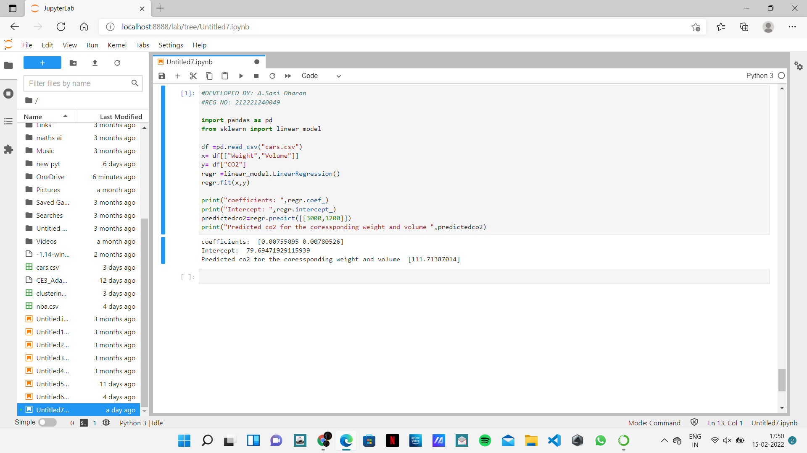

# Implementation of Multivariate Linear Regression
## Aim
To write a python program to implement multivariate linear regression and predict the output.
## Equipment’s required:
1.	Hardware – PCs
2.	Anaconda – Python 3.7 Installation / Moodle-Code Runner
## Algorithm:
### Step1
Import panda

### Step2
Import linear model from sklearn

### Step3
Read the file cars.csv

### Step4
Assign the values for x and y as required

### Step5
Create the linearRegression model and predict the output

## Program:
```
#DEVELOPED BY: A.Sasi Dharan
#REG NO: 212221240049

import pandas as pd
from sklearn import linear_model

df =pd.read_csv("cars.csv")
x= df[["Weight","Volume"]]
y= df["CO2"]
regr =linear_model.LinearRegression()
regr.fit(x,y)

print("coefficients: ",regr.coef_)
print("Intercept: ",regr.intercept_)
predictedco2=regr.predict([[3000,1200]])
print("Predicted co2 for the coressponding weight and volume ",predictedco2)


```
## Output:


<br>

## Result
Thus the multivariate linear regression is implemented and predicted the output using python program.